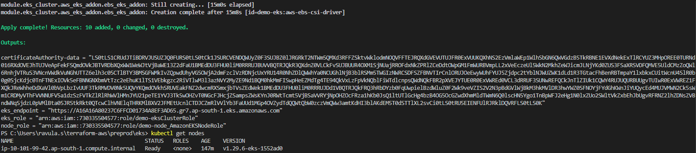
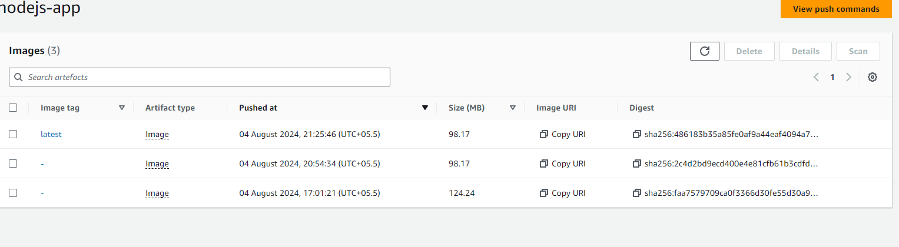

# Swimlane Dev-ops Practical

## Infra setup
You will find two branches feature/terraform , feature/devops-practical

1. feature/terraform contains all the infrastructure code , i used my AWS account to spin-up required infra for 
   this practical, i.e VPC, subnets,Nat-gateways, jump host, ECR, and finally EKS.
   you will find lots of commented code in EKS module, initially spin-up fully private EKS cluster with out NAT 
   gateway using VPC endpoints, later changed it to managed nodegroup with NAT gateway in private subnet.
2. Code is build using terraform modules, you can tweak the parameters according to the requirements, modify the main.tf run the commands. EKS nodes will be created will all respected permissions i.e permission     to pull the image from ECR repo with out any secrets.

## Usage
```bash
terraform init
terrform plan
terraform apply
```



## Dockizing the application
The other branch contains the  app code and helm charts
1. here is the Dockerfile to build the container

```bash
FROM node:lts-slim
WORKDIR /usr/src/app
COPY . .
RUN npm install
EXPOSE 3000
CMD ["npm", "start"]
```
2. To build a docker file , used below commands to build and push the image to respective ECR images

```bash
aws ecr get-login-password --region ap-south-1 | docker login --username AWS --password-stdin XXXXXXXXXXXX.dkr.ecr.ap-south-1.amazonaws.com
docker build -t XXXXXXXXXXXX.dkr.ecr.ap-south-1.amazonaws.com .
docker tag XXXXXXXXXXXX.dkr.ecr.ap-south-1.amazonaws.com:v1.0.1 XXXXXXXXXXXX.dkr.ecr.ap-south-1.amazonaws.com/nodejs-app:latest
docker push XXXXXXXXXXXX.dkr.ecr.ap-south-1.amazonaws.com/nodejs-app:latest
```



3. app Requires mongodb, inital requirement says it should run as container, lots of tutorials are persent on internet used bitnami image to intall mongo as standalone.
```bash
helm repo add bitnami https://charts.bitnami.com/bitnami
helm install my-mongo bitnami/mongodb --set architecture="standalone" --set replicaCount=1
``` 
 you can customize using own values.yml file

4. updating mongo DB url in .env file and put it in secrets, Here i faced lil bit trouble, initially i tried to put each key in kubernetes native secrets, but it was not replacing inside the container 
 MONGODB_URL=mongodb://${mongo-username}:${mongo-password}@${mongo-hostname}:27017/sample
 
 after carefull oberservation of the code it's using single key MONGODB_URL as a placeholder, so two ways to update this in secrets, one create secretyml file with single base64 encode value, other thing is create using .env file.

 ```bash
kubectl create secret generic db-secret --from-env-file=.env
 ``` 
 and use this secret in your deployment.yml
 The connection string for db for 
 <namespace>.<service-name>.<svc>.<cluster>.<local>
 database.database.svc.cluster.local

5. Templatizing the manifests
you can create a helm chart using below command
```bash
helm create <chartnanme>
```

it will create a folder in respective directory, with all the file, you can remove all unnecessary files
edit the values.yml file and replace you deployment manifest with jinja 
after templating all the necesary arguments, bellow commands to dry run and install and upgrade the charts

```bash
helm install <appname> --dry-run --debug ./web-app
helm install myapp ./web-app
```
.png>)
.png>)


To upgrdae to latest chart

```bash
helm upgrade myapp ./web-app
```
.png>)


after installation verify the deployemnts

.png>)

.png>)

Here i used to tested the app using curl, as i created private cluster, i need to deploy the ingress to access the app from outside, i didn't create ingress here

.png>)

.png>)

